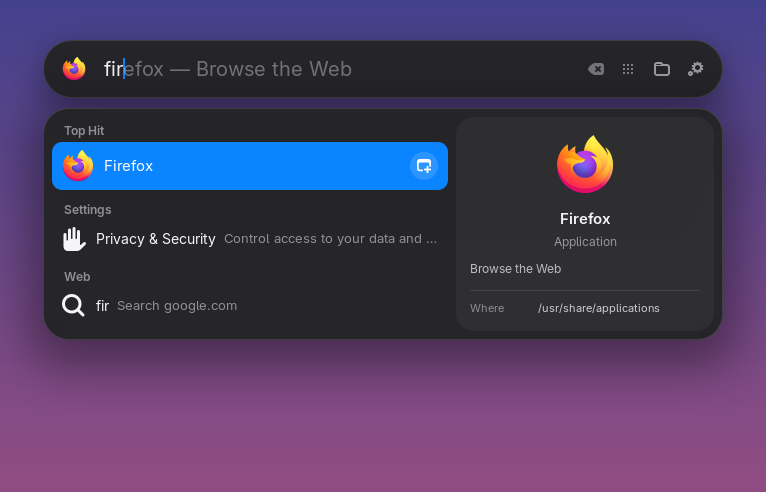
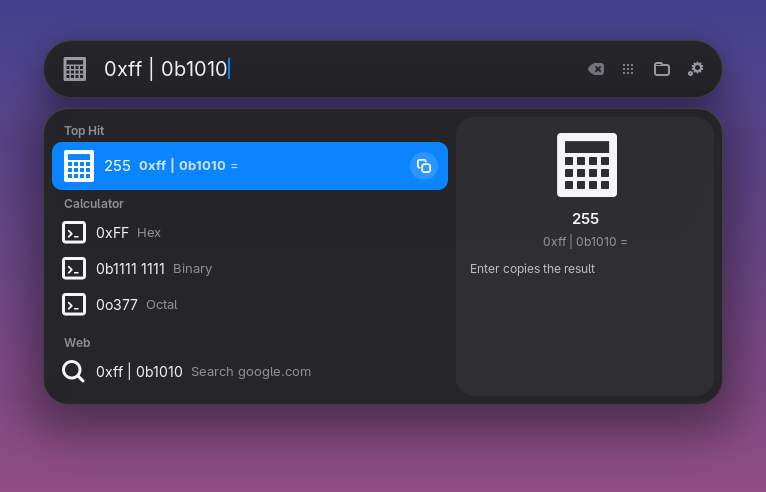
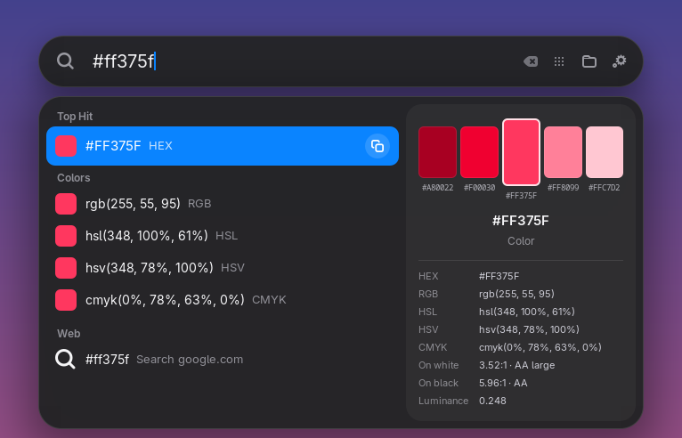
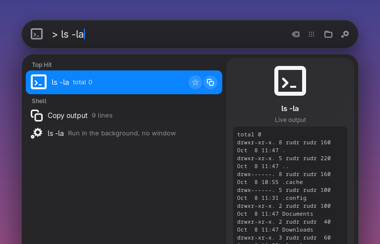
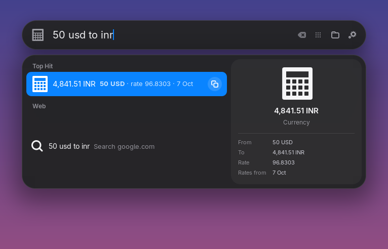
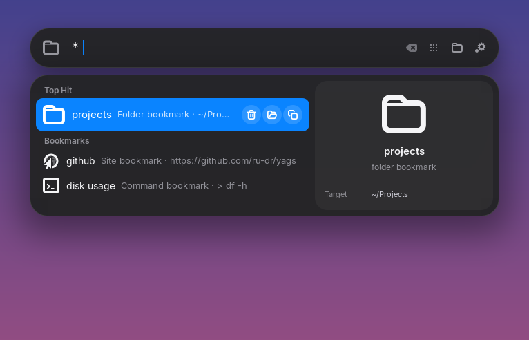
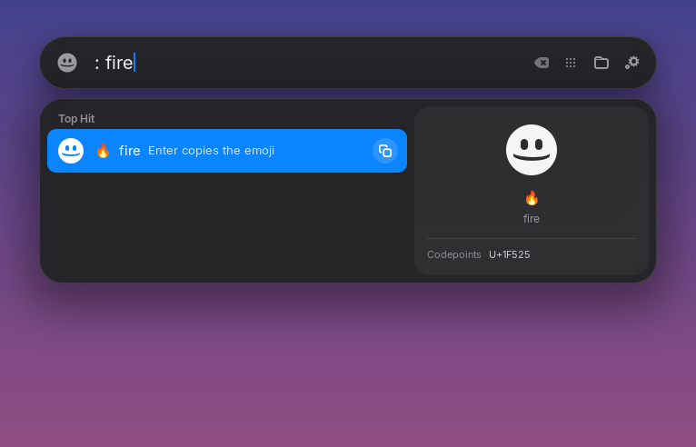
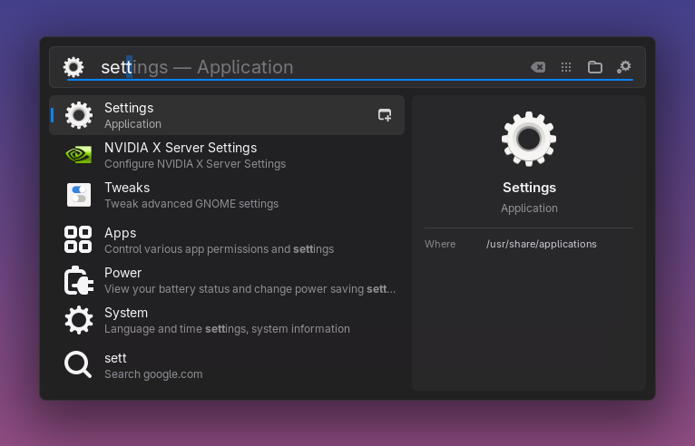

<div align="center">

# yags

**Yet Another GNOME Search**

A macOS-inspired, keyboard-first launcher for GNOME Shell, with PowerToys Run style plugins.

`Super + Space`, type, `Enter`.




</div>

---

## Why

GNOME's Overview search is good, but it is tied to the Overview. yags replaces it with a floating search bar that opens over any window, even fullscreen video, and adds the things you would otherwise need five different tools for: a calculator, unit and currency conversion, colour tools, a live shell, bookmarks, clipboard history and fast file search.

Every one of those features is a **plugin**. You can turn each one off, give it your own prefix, or write your own in JavaScript, Python, Bash or anything else that can read and write JSON.

## Highlights

<table>
<tr>
<td width="50%" valign="top"><br><b>Calculator and dev tools.</b> Just type <code>2^10 / 3</code>, <code>0xff to bin</code> or <code>sqrt 2</code>. No <code>=</code> needed.</td>
<td width="50%" valign="top"><br><b>Colours.</b> <code>#0a84ff</code>, <code>rgb()</code> or <code>hsl()</code>: every format, a five-step spectrum and WCAG contrast.</td>
</tr>
<tr>
<td width="50%" valign="top"><br><b>Live shell.</b> <code>&gt; ls -la</code> shows the output as you type. Only safe, read-only commands run in the preview.</td>
<td width="50%" valign="top"><br><b>Currency and units.</b> <code>50 usd to inr</code>, <code>10 km to mi</code>, <code>1 GiB to MB</code>.</td>
</tr>
<tr>
<td width="50%" valign="top"><br><b>Bookmarks.</b> Files, folders, locations, commands and sites. <code>Ctrl + D</code> on any result adds one.</td>
<td width="50%" valign="top"><br><b>Your own plugins.</b> This emoji picker is a 60-line Python script.</td>
</tr>
</table>

- **Top Hit**, inline completion, a preview pane, and a bar icon that follows the selection
- Filters for Apps, Files, Actions and Clipboard (`Super + 1` to `4`)
- Row actions: open in a new window, show in folder, copy, bookmark
- Fast file search with `plocate`, plus recent files and a live view of your home folders
- Opens over fullscreen apps, and `Super + Space` never leaks a key press into the app behind it
- Uses your system font and follows the light or dark theme, with your own accent colour
- A full CLI (`yags`) and a preferences window, and every change applies live
- Two looks: the default Mac style, or `yags style powertoys` for a single window

<details>
<summary>PowerToys style</summary>



</details>

## Install

You need GNOME Shell 48 or newer. `plocate` (file search) and the Copyous extension (clipboard) are optional.

```bash
git clone https://github.com/ru-dr/yags.git
cd yags
./bin/yags install       # installs the extension and links the yags CLI into ~/.local/bin
```

Log out and back in, because Wayland only loads new extensions at login. Then run:

```bash
yags enable
yags doctor              # checks dependencies, shortcut and prefix conflicts
```

For development, `./bin/yags install --link` symlinks the checkout instead.

## Using it

Type anything and every source is searched together. Calculator, units, currency, colours, time and generators answer on their own when the query looks like one of theirs.

A **prefix** limits the search to one plugin. Symbol prefixes work right away (`>ls`), and word prefixes need a space (`f report`).

| Prefix | Plugin | Example |
|---|---|---|
| `=` | Calculator, only | `= 2pi` |
| `>` | Shell | `> git status` |
| `?` | Web | `? gnome shell`, `yt lofi` |
| `*` | Bookmarks | `* docs`, `*+ ~/Projects` adds one |
| `f` | Files | `f invoice` |
| `win` | Open windows | `win firefox` |
| `clip` | Clipboard | `clip password` |

Prefixes are yours to change:

```bash
yags keyword                 # list them
yags keyword files /         # files now uses "/"
yags keyword windows none    # no prefix
yags keyword files default   # back to "f"
```

You can also change them in **Preferences → Plugins**.

### Keys

| Key | Action |
|---|---|
| `Super + Space` | Open or close |
| `Super` or `Esc` | Close |
| `↑` `↓` | Move through results |
| `Tab` or `→` | Accept the inline completion |
| `Enter` | Open or run |
| `Ctrl + Enter` | New window of the selected app |
| `Ctrl + Shift + E` or `Super + Enter` | Show in folder |
| `Ctrl + Shift + C` or `Super + C` | Copy the path or value |
| `Ctrl + D` | Bookmark the selection, or remove a bookmark |
| `Super + 1` to `4` | Apps, Files, Actions, Clipboard filter |
| `Backspace` on an empty bar | Clear the filter |

## What is a plugin, and what is GNOME

yags does not use GNOME's search UI, but it does reuse GNOME's **search providers**: apps, Settings panels, and anything an app registers (Files, Calendar, Contacts and others). Everything else is a yags plugin.

| Comes from GNOME | yags plugins (bundled) |
|---|---|
| Apps, Settings, and app search providers | calc, units, currency, colors, generators, time, shell, web, bookmarks, files, windows, clipboard |
| `yags source` lists and toggles them | `yags plugin` lists and toggles them |

```bash
yags source off contacts calendar
yags plugin disable currency
```

## Plugins

A plugin is a folder with a `manifest.json` and either a JavaScript module or any executable. Drop it in `~/.local/share/yags/plugins/`. It can add results, previews, row buttons and its own settings, which appear in the preferences window automatically.

```bash
yags plugin new weather                          # JavaScript
yags plugin new todo --type script --lang python # or Python, or --lang bash
yags plugin install https://github.com/you/yags-plugin-x
yags plugin reload
```

A complete JavaScript plugin:

```js
export default class Hello {
    constructor(api) {
        this.api = api;
    }

    query({query}) {
        const text = `Hello, ${query || 'world'}!`;
        return [{title: text, icon: 'face-smile-symbolic', copy: text}];
    }
}
```

A complete script plugin, in any language:

```python
#!/usr/bin/env python3
import json, sys

request = json.loads(sys.stdin.readline())
if sys.argv[1] == "query":
    q = request["query"]
    print(json.dumps({"results": [{"title": q.upper(), "copy": q.upper()}]}))
```

**📘 Read the [plugin guide](docs/PLUGINS.md)** for the manifest, the API, previews, actions and settings. Working examples are in [`examples/plugins`](examples/plugins).

## Configure

Everything applies live, with no logout.

```bash
yags                          # status
yags prefs                    # graphical preferences
yags list                     # every setting
yags style mac                # mac | powertoys
yags theme dark               # default | dark | light
yags accent '#ff375f'
yags shortcut super+space
yags set corner-radius 18
yags set width 760
yags set max-rows 7
yags set search-engine 'https://duckduckgo.com/?q=%s'
yags set currencies 'USD, EUR, INR'
yags set terminal kitty
yags feature off bounce preview
yags bookmark add docs ~/Documents
yags reset --all
```

The full reference is in the [wiki](https://github.com/ru-dr/yags/wiki).

## Troubleshooting

- **The bar is invisible, or typing does nothing.** Another extension is hiding the Overview search, such as Just Perfection's *Search* option. Turn that option back on.
- **`Super + Space` does nothing.** Run `yags doctor`, which lists anything else bound to the same keys.
- **A new file doesn't show up.** plocate reindexes once a day. Run `sudo updatedb` to refresh it now.
- **A plugin doesn't load.** It is listed under *Not loaded* in Preferences → Plugins, with the reason. `journalctl --user -f -o cat | grep yags` shows its log.
- **Code changes don't apply.** On Wayland, GNOME Shell only reloads extension code at login. Settings and plugin reloads are live.

## Development

```bash
npm install          # ESLint, for make lint
make check           # syntax, schema, lint, JS and Python tests
make link            # install as a symlink
make zip             # build an extensions.gnome.org bundle
```

The code is laid out like this:

| Path | Contents |
|---|---|
| `lib/core` | Config, patching and stylesheets |
| `lib/overview` | Taking over Overview search |
| `lib/results` | Result list layout and preview |
| `lib/launcher` | The window, keys and actions |
| `lib/plugins` | The plugin host |
| `plugins/` | Bundled plugins |
| `prefs/` | Preferences pages |
| `cli/` | The `yags` tool |

Issues and pull requests are welcome.

## Credits

yags started as a fork of [Spotlight](https://github.com/itsnin/spotlight) by itsnin, and was rewritten by [ru-dr](https://github.com/ru-dr). It is inspired by macOS Spotlight and PowerToys Run, but is not affiliated with either.

Licensed under [GPL-3.0-or-later](LICENSE).
